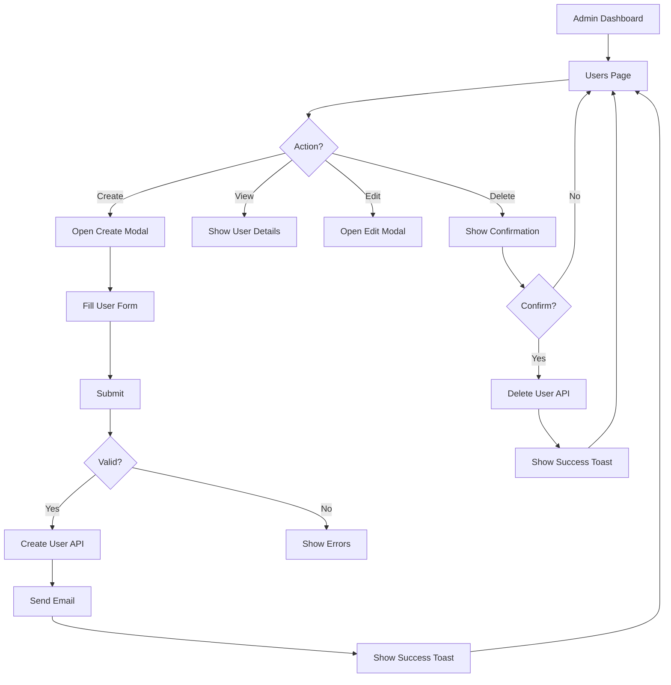
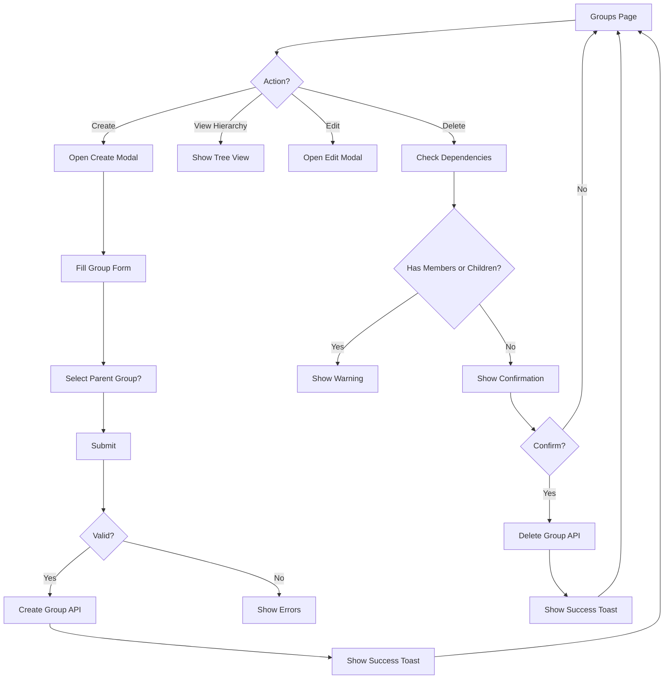
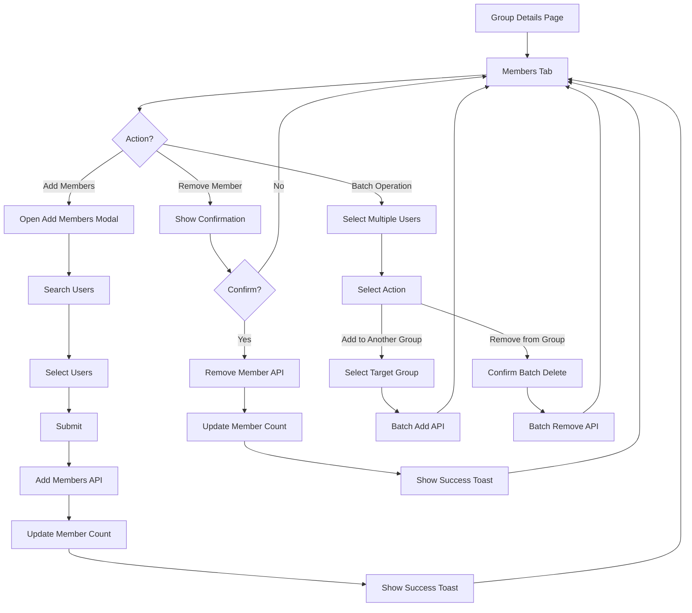
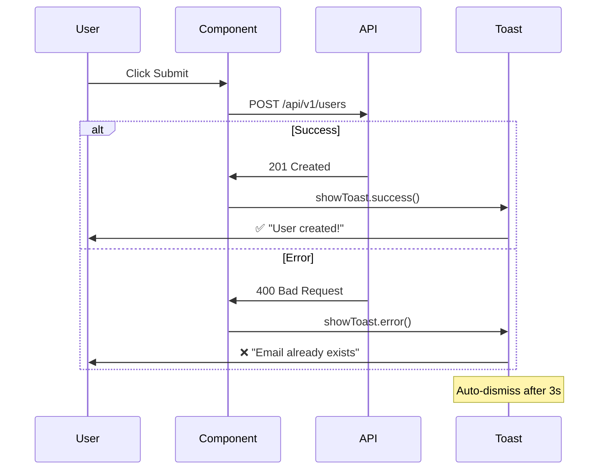
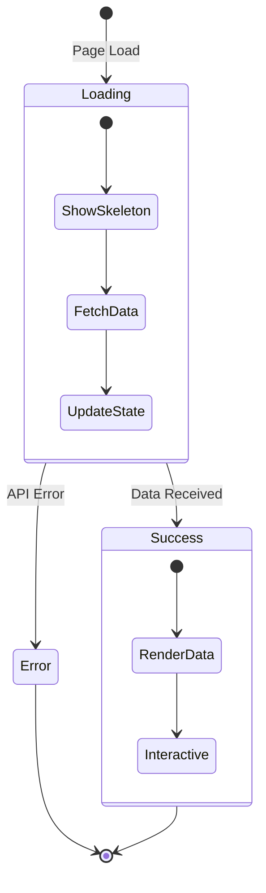
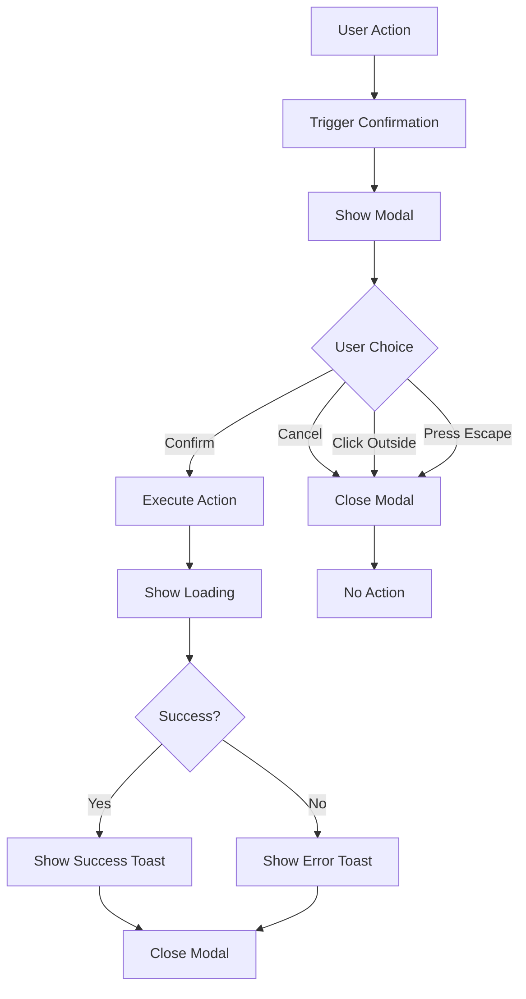
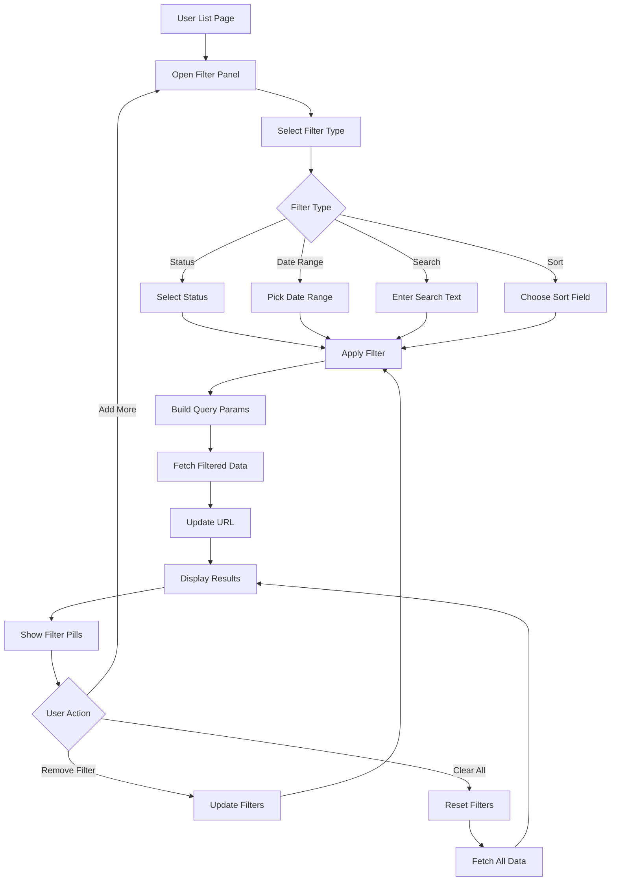

# User Stories & Feature Specifications - Sentinela IAM

**Version:** v1.1
**Last Updated:** November 12, 2025
**Status:** Planning Phase

---

## Table of Contents
- [Epic 1: User and Group Management](#epic-1-user-and-group-management)
- [Epic 2: UX Improvements](#epic-2-ux-improvements)
- [Epic 3: Advanced Filters](#epic-3-advanced-filters)

---

## Epic 1: User and Group Management

**Priority:** High
**Effort:** Medium
**Business Value:** Enable complete user lifecycle management and organizational structure

### User Story 1.1: User CRUD Operations

**As a** system administrator
**I want to** create, read, update, and delete user accounts
**So that** I can manage the complete lifecycle of users in the IAM system

#### Acceptance Criteria
- [ ] Admin can create new users with email, name, and initial password
- [ ] Admin can view user details including profile photo
- [ ] Admin can edit user information (name, email, role)
- [ ] Admin can delete users (with confirmation)
- [ ] Admin can set user status (active/inactive/blocked)
- [ ] Admin can reset user passwords
- [ ] System validates email uniqueness
- [ ] System sends email notification on user creation

#### Technical Specifications

**Backend Endpoints:**
```python
POST   /api/v1/users/                    # Create user
GET    /api/v1/users/                    # List users (paginated)
GET    /api/v1/users/{id}                # Get user details
PUT    /api/v1/users/{id}                # Update user
DELETE /api/v1/users/{id}                # Delete user
PATCH  /api/v1/users/{id}/status         # Update user status
POST   /api/v1/users/{id}/reset-password # Reset password
POST   /api/v1/users/{id}/photo          # Upload profile photo
```

**Database Model:**
```python
class User:
    id: UUID
    email: str (unique, indexed)
    name: str
    password_hash: str
    photo_url: Optional[str]
    status: Enum(active, inactive, blocked)
    role: Enum(admin, user, viewer)
    created_at: datetime
    updated_at: datetime
    last_login: Optional[datetime]
```

**Frontend Components:**
```typescript
- UserListPage.tsx          // Main user list with table
- UserCreateModal.tsx       // Create user modal
- UserEditModal.tsx         // Edit user modal
- UserDetailCard.tsx        // User detail view
- UserStatusBadge.tsx       // Status indicator
- UserPhotoUpload.tsx       // Photo upload component
```

#### Flow Diagram



#### Definition of Done
- [ ] All CRUD endpoints implemented and tested
- [ ] Frontend components created with proper validation
- [ ] Unit tests with >80% coverage
- [ ] Integration tests for API endpoints
- [ ] Email notifications working
- [ ] Photo upload functional with size/format validation
- [ ] Responsive design implemented
- [ ] Documentation updated

---

### User Story 1.2: Group CRUD Operations

**As a** system administrator
**I want to** create and manage organizational groups
**So that** I can organize users into logical hierarchies for permission management

#### Acceptance Criteria
- [ ] Admin can create new groups with name and description
- [ ] Admin can view all groups with member counts
- [ ] Admin can edit group information
- [ ] Admin can delete groups (with confirmation)
- [ ] Admin can create group hierarchies (parent/child)
- [ ] System shows member count for each group
- [ ] System prevents circular group dependencies

#### Technical Specifications

**Backend Endpoints:**
```python
POST   /api/v1/groups/           # Create group
GET    /api/v1/groups/           # List groups (with hierarchy)
GET    /api/v1/groups/{id}       # Get group details
PUT    /api/v1/groups/{id}       # Update group
DELETE /api/v1/groups/{id}       # Delete group
GET    /api/v1/groups/{id}/tree  # Get group hierarchy tree
```

**Database Model:**
```python
class Group:
    id: UUID
    name: str (unique)
    description: Optional[str]
    parent_id: Optional[UUID]  # Self-referencing FK
    member_count: int (computed)
    created_at: datetime
    updated_at: datetime

    # Relationships
    parent: Optional[Group]
    children: List[Group]
    users: List[User]
```

**Frontend Components:**
```typescript
- GroupListPage.tsx          // Main group list
- GroupCreateModal.tsx       // Create group modal
- GroupEditModal.tsx         // Edit group modal
- GroupTreeView.tsx          // Hierarchical tree view
- GroupCard.tsx              // Group display card
```

#### Flow Diagram



---

### User Story 1.3: User-Group Association

**As a** system administrator
**I want to** add and remove users from groups
**So that** I can control user access based on group membership

#### Acceptance Criteria
- [ ] Admin can add users to groups
- [ ] Admin can remove users from groups
- [ ] Admin can view all members of a group
- [ ] Admin can perform batch operations (add/remove multiple users)
- [ ] System updates member count automatically
- [ ] System shows user's group memberships in user profile

#### Technical Specifications

**Backend Endpoints:**
```python
POST   /api/v1/groups/{id}/members           # Add users to group
DELETE /api/v1/groups/{id}/members/{user_id} # Remove user from group
GET    /api/v1/groups/{id}/members           # List group members
POST   /api/v1/groups/{id}/members/batch     # Batch add users
DELETE /api/v1/groups/{id}/members/batch     # Batch remove users
GET    /api/v1/users/{id}/groups             # Get user's groups
```

**Database Model:**
```python
class UserGroup:
    user_id: UUID (FK)
    group_id: UUID (FK)
    added_at: datetime
    added_by: UUID (FK to User)

    # Composite primary key (user_id, group_id)
```

**Frontend Components:**
```typescript
- GroupMembersPanel.tsx      // Group members list
- AddMembersModal.tsx        // Add members modal with search
- MemberCard.tsx             // Member display card
- BatchOperationsBar.tsx     // Bulk actions toolbar
```

#### Flow Diagram



---

## Epic 2: UX Improvements

**Priority:** High
**Effort:** Low
**Business Value:** Enhance user experience with modern UI patterns

### User Story 2.1: Toast Notifications

**As a** user
**I want to** see modern toast notifications for actions
**So that** I get clear, non-intrusive feedback about system operations

#### Acceptance Criteria
- [ ] Replace all `alert()` calls with toast notifications
- [ ] Support 4 types: success, error, warning, info
- [ ] Toasts auto-dismiss after 3-5 seconds
- [ ] Toasts are stackable (multiple can show at once)
- [ ] Toasts have smooth animations (slide-in/fade-out)
- [ ] Toasts are accessible (screen reader support)
- [ ] Position: top-right corner

#### Technical Specifications

**Library:** `react-hot-toast` or `sonner`

**Installation:**
```bash
npm install react-hot-toast
# or
npm install sonner
```

**Implementation:**
```typescript
// lib/toast.ts
import toast from 'react-hot-toast';

export const showToast = {
  success: (message: string) => toast.success(message),
  error: (message: string) => toast.error(message),
  warning: (message: string) => toast(message, { icon: '⚠️' }),
  info: (message: string) => toast(message, { icon: 'ℹ️' }),
};

// Usage example
showToast.success('User created successfully!');
showToast.error('Failed to delete resource');
```

**Components to Update:**
```typescript
- All pages with alert() calls
- Form submission handlers
- API error handlers
- Delete confirmations feedback
```

#### Flow Diagram



#### Definition of Done
- [ ] Library installed and configured
- [ ] Toast provider added to root layout
- [ ] All alert() calls replaced
- [ ] Custom toast styling matching design system
- [ ] Accessibility tested with screen reader
- [ ] Documentation updated with usage examples

---

### User Story 2.2: Loading States

**As a** user
**I want to** see loading indicators during data fetching
**So that** I know the system is processing my request

#### Acceptance Criteria
- [ ] Skeleton loaders shown during initial page load
- [ ] Spinner shown during form submissions
- [ ] Buttons disabled during operations
- [ ] Progress indicators for long operations
- [ ] Loading state for table data
- [ ] Loading state for cards/grids

#### Technical Specifications

**Components:**
```typescript
// components/LoadingStates.tsx
export const Skeleton = () => (
  <div className="animate-pulse">
    <div className="h-4 bg-gray-200 rounded w-3/4"></div>
    <div className="h-4 bg-gray-200 rounded w-1/2 mt-2"></div>
  </div>
);

export const TableSkeleton = () => (
  <div className="space-y-4">
    {[...Array(5)].map((_, i) => <Skeleton key={i} />)}
  </div>
);

export const Spinner = () => (
  <svg className="animate-spin h-5 w-5" viewBox="0 0 24 24">
    <circle className="opacity-25" cx="12" cy="12" r="10" />
    <path className="opacity-75" d="M4 12a8 8 0 018-8V0..." />
  </svg>
);

// Button with loading state
export const LoadingButton = ({ loading, children, ...props }) => (
  <button disabled={loading} {...props}>
    {loading ? <Spinner /> : children}
  </button>
);
```

**Usage Pattern:**
```typescript
const [loading, setLoading] = useState(true);
const [data, setData] = useState(null);

useEffect(() => {
  fetchData().then(setData).finally(() => setLoading(false));
}, []);

if (loading) return <TableSkeleton />;
return <Table data={data} />;
```

#### Flow Diagram



#### Definition of Done
- [ ] Skeleton components created
- [ ] All data fetching wrapped with loading states
- [ ] Buttons disabled during operations
- [ ] Smooth transitions between states
- [ ] No layout shift during loading
- [ ] Tested on slow network conditions

---

### User Story 2.3: Modern Confirmations

**As a** user
**I want to** see modern confirmation dialogs
**So that** I can confidently confirm or cancel destructive actions

#### Acceptance Criteria
- [ ] Replace all `confirm()` calls with custom modal
- [ ] Modal shows clear action description
- [ ] Modal highlights destructive actions (red button)
- [ ] Modal supports custom messages
- [ ] Keyboard navigation (Enter/Escape)
- [ ] Click outside to cancel
- [ ] Smooth animations

#### Technical Specifications

**Component:**
```typescript
// components/ConfirmationModal.tsx
interface ConfirmationModalProps {
  isOpen: boolean;
  onClose: () => void;
  onConfirm: () => void;
  title: string;
  message: string;
  confirmText?: string;
  cancelText?: string;
  variant?: 'danger' | 'warning' | 'info';
}

export const ConfirmationModal = ({
  isOpen,
  onClose,
  onConfirm,
  title,
  message,
  confirmText = 'Confirm',
  cancelText = 'Cancel',
  variant = 'danger'
}) => {
  if (!isOpen) return null;

  return (
    <div className="fixed inset-0 z-50 flex items-center justify-center">
      <div className="absolute inset-0 bg-black opacity-50" onClick={onClose} />
      <div className="relative bg-white rounded-lg p-6 max-w-md">
        <h3 className="text-lg font-bold">{title}</h3>
        <p className="mt-2 text-gray-600">{message}</p>
        <div className="mt-4 flex gap-2">
          <button onClick={onClose} className="btn-secondary">
            {cancelText}
          </button>
          <button
            onClick={onConfirm}
            className={variant === 'danger' ? 'btn-danger' : 'btn-primary'}
          >
            {confirmText}
          </button>
        </div>
      </div>
    </div>
  );
};
```

**Usage:**
```typescript
const [showConfirm, setShowConfirm] = useState(false);

const handleDelete = () => {
  setShowConfirm(true);
};

const confirmDelete = async () => {
  await deleteUser(userId);
  setShowConfirm(false);
  showToast.success('User deleted successfully');
};

return (
  <>
    <button onClick={handleDelete}>Delete User</button>
    <ConfirmationModal
      isOpen={showConfirm}
      onClose={() => setShowConfirm(false)}
      onConfirm={confirmDelete}
      title="Delete User"
      message="Are you sure you want to delete this user? This action cannot be undone."
      confirmText="Delete"
      variant="danger"
    />
  </>
);
```

#### Flow Diagram



---

## Epic 3: Advanced Filters

**Priority:** Medium
**Effort:** Low
**Business Value:** Improve data discoverability and user productivity

### User Story 3.1: Combined Filters

**As a** user
**I want to** apply multiple filters simultaneously
**So that** I can quickly find specific records

#### Acceptance Criteria
- [ ] Support multiple simultaneous filters
- [ ] Filters are applied with AND logic
- [ ] Filter by date range (created_at, updated_at)
- [ ] Filter by status/enum fields
- [ ] Filter by text search (name, email, description)
- [ ] Clear all filters button
- [ ] Show active filter count badge
- [ ] Persist filters in URL params
- [ ] Save filter presets (optional)

#### Technical Specifications

**Component:**
```typescript
// components/FilterPanel.tsx
interface Filter {
  field: string;
  operator: 'eq' | 'contains' | 'gt' | 'lt' | 'between';
  value: any;
}

interface FilterPanelProps {
  filters: Filter[];
  onFilterChange: (filters: Filter[]) => void;
  schema: FilterSchema[];
}

export const FilterPanel = ({ filters, onFilterChange, schema }) => {
  return (
    <div className="bg-white p-4 rounded-lg shadow">
      <div className="flex items-center justify-between mb-4">
        <h3 className="font-semibold">Filters</h3>
        {filters.length > 0 && (
          <button onClick={() => onFilterChange([])}>
            Clear All ({filters.length})
          </button>
        )}
      </div>

      {schema.map(field => (
        <FilterField
          key={field.name}
          field={field}
          value={filters.find(f => f.field === field.name)}
          onChange={(value) => updateFilter(field.name, value)}
        />
      ))}
    </div>
  );
};
```

**API Implementation:**
```python
# Backend support for filters
@router.get("/users/")
def list_users(
    skip: int = 0,
    limit: int = 20,
    status: Optional[str] = Query(None),
    search: Optional[str] = Query(None),
    created_after: Optional[datetime] = Query(None),
    created_before: Optional[datetime] = Query(None),
    sort_by: Optional[str] = Query("created_at"),
    sort_order: Optional[str] = Query("desc"),
    db: Session = Depends(get_db)
):
    query = db.query(User)

    # Apply filters
    if status:
        query = query.filter(User.status == status)
    if search:
        query = query.filter(
            or_(
                User.name.contains(search),
                User.email.contains(search)
            )
        )
    if created_after:
        query = query.filter(User.created_at >= created_after)
    if created_before:
        query = query.filter(User.created_at <= created_before)

    # Apply sorting
    if sort_order == "desc":
        query = query.order_by(desc(getattr(User, sort_by)))
    else:
        query = query.order_by(asc(getattr(User, sort_by)))

    total = query.count()
    users = query.offset(skip).limit(limit).all()

    return {
        "total": total,
        "items": users,
        "filters_applied": {
            "status": status,
            "search": search,
            "date_range": f"{created_after} to {created_before}"
        }
    }
```

#### Flow Diagram



#### Definition of Done
- [ ] Filter component created and styled
- [ ] Backend supports all filter parameters
- [ ] Filters persist in URL params
- [ ] Filter pills show active filters
- [ ] Performance tested with large datasets
- [ ] Mobile responsive design
- [ ] Accessibility tested (keyboard navigation)

---

## Implementation Order Recommendation

### Phase 1: Quick Wins (Week 1)
1. ✅ **Toast Notifications** (1-2 days)
   - Low complexity, high impact
   - Improves UX immediately

2. ✅ **Loading States** (1-2 days)
   - Low complexity, high impact
   - Better perceived performance

3. ✅ **Modern Confirmations** (1 day)
   - Low complexity
   - Replaces unsafe browser dialogs

### Phase 2: Core Features (Week 2)
4. 🔨 **User CRUD** (3-4 days)
   - Backend + Frontend + Tests
   - Foundation for other features

5. 🔨 **Group CRUD** (2-3 days)
   - Backend + Frontend + Tests
   - Enables organizational structure

6. 🔨 **User-Group Association** (2-3 days)
   - Backend + Frontend + Tests
   - Completes group management

### Phase 3: Enhancements (Week 3)
7. 🎯 **Advanced Filters** (2-3 days)
   - Improves data discovery
   - Increases productivity

---

## Testing Strategy

### Unit Tests
- All utility functions
- React components (with React Testing Library)
- API endpoint handlers
- Database models

### Integration Tests
- API endpoint flows
- Database operations
- Authentication flows

### E2E Tests
- Complete user journeys
- Critical paths (user creation → group assignment)
- Form validations

### Performance Tests
- API response times
- Frontend rendering
- Large dataset handling

---

## Dependencies

### Frontend Libraries to Install
```json
{
  "dependencies": {
    "react-hot-toast": "^2.4.1",
    "react-hook-form": "^7.48.2",
    "zod": "^3.22.4",
    "@tanstack/react-query": "^5.8.4"
  }
}
```

### Backend Libraries to Install
```txt
python-multipart>=0.0.6  # For file uploads
Pillow>=10.1.0           # For image processing
email-validator>=2.1.0   # For email validation
```

---

## Risk Management

### Potential Risks

1. **User Data Migration**
   - Risk: Existing users need migration to new schema
   - Mitigation: Create migration script with rollback

2. **Performance with Large Groups**
   - Risk: Hierarchical queries may be slow
   - Mitigation: Implement caching, add database indexes

3. **Photo Upload Storage**
   - Risk: Local storage may fill up
   - Mitigation: Use cloud storage (S3, CloudFlare R2)

4. **Email Service Dependency**
   - Risk: Email service downtime affects notifications
   - Mitigation: Queue emails, implement retry logic

---

## Success Metrics

### KPIs to Track

1. **User Management**
   - Average time to create a user: < 30 seconds
   - User search response time: < 200ms
   - Photo upload success rate: > 95%

2. **UX Improvements**
   - Toast notification visibility: > 90%
   - Loading state perceived performance: improve by 40%
   - User satisfaction score: > 4.5/5

3. **Filters**
   - Filter usage rate: > 60% of sessions
   - Average filters per search: 2-3
   - Search result satisfaction: > 80%

---

**Document Status:** ✅ Ready for Implementation
**Next Steps:** Begin Phase 1 with Toast Notifications

---

**Maintained by:** Development Team
**Review Cycle:** Weekly during implementation
**Feedback:** GitHub Issues or team meetings
